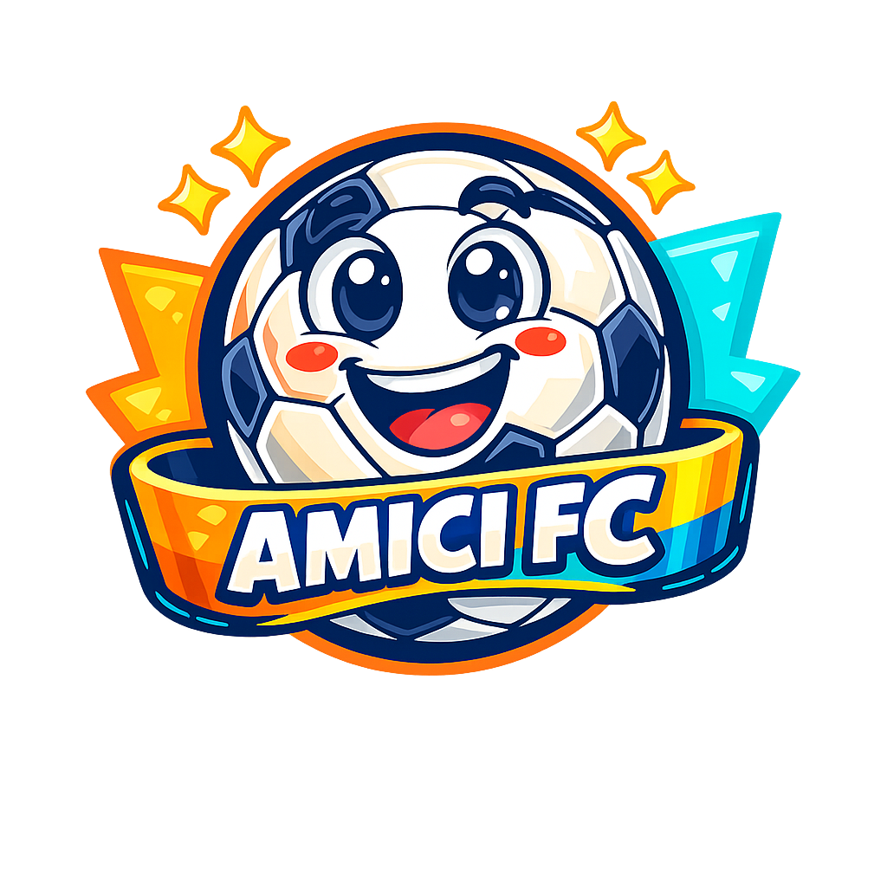

# ⚽ Amici FC – Il Calcetto Manager Definitivo

> **"Dove i campioni nascono… e litigano!"**



## 🎯 Descrizione

**Amici FC** è una Progressive Web App (PWA) completa per gestire le partite di calcetto tra amici. Divertente, colorata, offline-first e con intelligenza artificiale integrata.

---

## ✨ Funzionalità Principali

### 👥 Multi-Gruppo
- Crea gruppi indipendenti (es. "Calcetto del Martedì", "Torneo Estivo")
- Ogni gruppo ha giocatori, storico e statistiche propri
- Selettore rapido nella topbar

### 👤 Gestione Giocatori
- Nome, cognome, soprannome, ruolo
- Foto giocatore (caricamento da dispositivo)
- Statistiche aggregate: goal, assist, media voto

### ⚽ Gestione Partite
1. **Generazione squadre** – AI bilanciata o casuale + drag & drop manuale
2. **Inserimento risultato** – Goal A/B, goal/assist/voto per ogni giocatore
3. **Pagelle & MVP** – Calcolati automaticamente

### 🤖 AI Multipla
- **Claude** (Anthropic)
- **Gemini 2.5** (Google)
- **ChatGPT** (OpenAI)

Genera commenti stile telecronista italiano, ironici e divertenti!

### 🖼️ PNG Condivisibili
- PNG Formazione (sfondo verde campo)
- PNG Risultato (stile social)
- PNG Pagelle (con voti e MVP)

### 📊 Statistiche
- Classifica marcatori
- Classifica assist
- Media voto

### 📤 Import / Export
- Export JSON del gruppo selezionato
- Import con merge intelligente e controllo duplicati

### 🌐 Offline-First + PWA
- Service Worker con cache intelligente
- IndexedDB per tutti i dati
- Installabile su Android, iOS, desktop
- Aggiornamenti automatici via `version.json`

---

## 🎨 Palette Colori

| Colore | Hex |
|--------|-----|
| Verde Lime | `#A6FF4D` |
| Blu Elettrico | `#3A7BFF` |
| Giallo Energetico | `#FFD93D` |
| Rosso Acceso | `#FF4D4D` |
| Nero Soft | `#1A1A1A` |
| Bianco Latte | `#F7F7F7` |

---

## 🛠️ Stack Tecnico

| Tecnologia | Utilizzo |
|-----------|---------|
| **Vue 3 CDN** | Frontend reattivo |
| **Dexie.js** | IndexedDB wrapper |
| **html2canvas** | Generazione PNG |
| **SortableJS** | Drag & Drop squadre |
| **Service Worker** | Offline-first |

---

## 🚀 Deploy su GitHub Pages

1. Fork / clona questo repository
2. Copia il tuo logo come `logo.png` nella root
3. Vai in **Settings → Pages → Deploy from branch (main)**
4. L'app sarà disponibile su `https://tuouser.github.io/amicifc/`

### Aggiornamenti automatici
Aggiorna `version.json` ad ogni release:
```json
{
  "version": "1.1.0",
  "date": "2026-06-01",
  "changelog": ["✅ Nuova feature..."]
}
```
L'app rileverà automaticamente la nuova versione all'avvio.

---

## 🤖 Configurazione AI

1. Vai in **Impostazioni → Configurazione AI**
2. Scegli il provider: Claude / Gemini / ChatGPT
3. Inserisci la tua API Key
4. Salva

Le API Key sono salvate localmente nel browser (non vengono inviate a server esterni tranne al provider scelto).

---

## 📁 Struttura File

```
amicifc/
├── index.html          # App completa (Vue 3 + tutto)
├── sw.js               # Service Worker
├── manifest.json       # PWA Manifest
├── version.json        # Versione per auto-update
├── logo.png            # Logo dell'app
├── icons/              # Icone PWA (varie dimensioni)
│   ├── icon-192.png
│   └── icon-512.png
└── README.md
```

---

## 📱 Compatibilità

- ✅ Android (Chrome, Samsung Internet)
- ✅ iOS (Safari, Chrome)
- ✅ Desktop (Chrome, Firefox, Edge, Safari)
- ✅ Installabile come PWA
- ✅ Funziona offline

---

## 🧾 Crediti

**Creato e sviluppato da Alby** 🕹️⚽

*"Il calcetto non è solo uno sport, è una filosofia di vita… e di amicizie!"*

Made with ❤️ + Vue 3 + IndexedDB + AI  
Versione 1.0.0 – Maggio 2026

---

## 📄 Licenza

MIT License – Fai quello che vuoi, ma tieni i crediti! 😄
