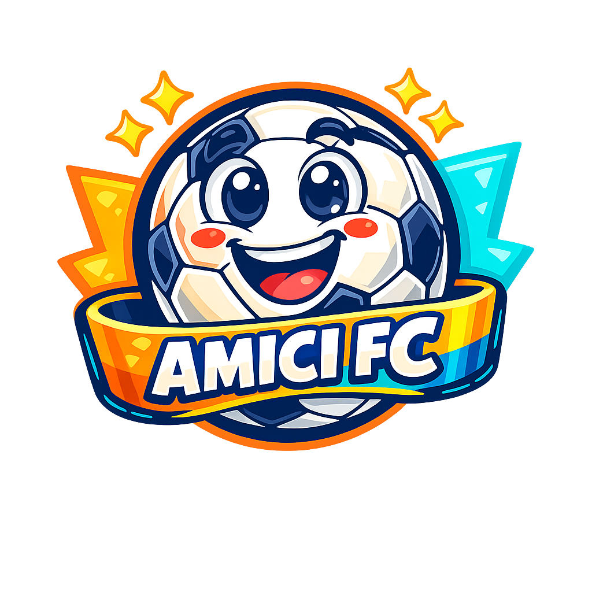

# ⚽ Amici FC – Il Calcetto Manager Definitivo

> **"Dove i campioni nascono… e litigano!"**



## 🎯 Descrizione

**Amici FC** è una Progressive Web App (PWA) completa per gestire un gruppo di calcetto amatoriale tra amici — dalle formazioni bilanciate dall'AI alle statistiche complete, dalle pagelle votate da tutti i giocatori al Riepilogo di fine stagione. Divertente, colorata, funziona offline e con intelligenza artificiale integrata in ogni angolo.

---

## ✨ Funzionalità Principali

### 👥 Multi-Gruppo
- Crea gruppi indipendenti (es. "Calcetto del Giovedì", "Torneo Estivo")
- Ogni gruppo ha giocatori, storico, statistiche e configurazione Firebase indipendenti
- Selettore rapido nella topbar

### ☁️ Sincronizzazione multi-dispositivo (opzionale)
- L'app funziona benissimo anche **senza configurare nulla** — tutti i dati restano sul dispositivo (IndexedDB)
- Collegando un progetto **Firebase Realtime Database** gratuito, i dati si sincronizzano automaticamente e in tempo reale su tutti i telefoni del gruppo — nessun file da scambiarsi
- Guida passo-passo alla configurazione inclusa nell'app stessa

### 👤 Gestione Giocatori
- Nome, soprannome, ruolo, piede preferito, foto, Numero Preferito, Squadra del Cuore
- Statistiche complete: gol, assist, media voto, presenze, Overall (OVR stile FIFA)
- **Portiere Dichiarato**: indica chi ha fatto il portiere in ogni partita, per Clean Sheet e OVR pesato accurati

### ⚽ Gestione Partite e Formazioni
1. **Generazione squadre** — bilanciate dall'**AI**, da un algoritmo statistico ("Consigliata"), o trascinate a mano
2. **Tre modi per inserire il risultato**: Uno alla Volta (un giocatore per schermata), Tutti Insieme (più veloce), o **Vota con gli amici**
3. **Infortuni e sostituzioni** durante la partita, con sostituto che eredita voti/gol/assist
4. **Rigori**: segnare un rigore aggiorna automaticamente anche il conteggio gol

### 🗳️ Pagelle votate da tutti ("Vota con gli amici")
- Ogni giocatore che ha partecipato può votare i compagni dal proprio telefono, con un **PIN personale** — nessun account richiesto
- Link condiviso via WhatsApp/Telegram, funziona anche senza l'app installata
- Il voto finale è la mediana dei voti ricevuti, con scarto automatico degli anomali
- Anche l'**Uomo Partita** può essere votato direttamente dai partecipanti

### 🏅 Achievement e Albo d'Oro
- Traguardi sbloccati automaticamente in base a quello che succede in campo — primo gol, hat-trick, 50 presenze, strisce di vittorie e molti altri
- Alcuni sono di carriera (restano per sempre), altri legati alla singola stagione

### 📖 Riepilogo Stagione
- A fine stagione, un riepilogo completo (vista in app + PDF scaricabile): copertina, numeri della stagione, classifiche, Annuario giocatori con soprannomi AI, formazioni migliori, curiosità, achievement sbloccati

### 🤖 Intelligenza Artificiale ovunque
- Provider supportati: **Gemini** (gratuito), **Groq** (gratuito), **OpenRouter** (multi-modello), **ChatGPT** (a pagamento)
- Soprannomi personalizzati, commenti da telecronista, Trash Talk irriverente, Hall of Fame/Shame del mese, pronostici pre-partita
- Nessuna statistica reale dipende dall'AI — è sempre un tocco in più, mai un requisito

### 🖼️ PNG e Card Condivisibili
- Formazione, Risultato, Pagelle, scheda giocatore — tutte pronte per WhatsApp

### 📊 Statistiche
- Classifiche complete: Gol, Assist, Media Voto, Punti, Overall, Clean Sheet, Uomo Partita, Autogol e altre
- Filtro per stagione (attuale o archiviata)

### 📤 Backup e Import/Export
- Export/Import JSON locale per portare i dati su un altro dispositivo o come backup di sicurezza
- Strumento diagnostico separato (**Inspector**) per chi gestisce Firebase: backup completo, diagnostica, correzioni avanzate

### 🌐 Offline-First + PWA
- Service Worker con cache intelligente
- IndexedDB per tutti i dati
- Installabile su Android, iOS, desktop
- Aggiornamenti automatici via `version.json`
- Onboarding guidato al primo avvio, con wizard passo-passo per l'installazione

---

## 🎨 Palette Colori

| Colore | Hex | Uso |
|--------|-----|-----|
| Verde Lime | `#A6FF4D` | Colore principale, Squadra A alternativo |
| Blu Elettrico | `#3A7BFF` | Squadra A |
| Arancione | `#FF8C00` | Squadra B |
| Giallo Energetico | `#FFD93D` | Accenti, avvisi |
| Rosso Acceso | `#FF4D4D` | Azioni distruttive, dati negativi |
| Nero Soft | `#1A1A1A` | Tema scuro (default) |

---

## 🛠️ Stack Tecnico

| Tecnologia | Utilizzo |
|-----------|---------|
| **Vue 3 CDN** | Frontend reattivo, nessun build step |
| **Dexie.js** | Wrapper IndexedDB per i dati locali |
| **Firebase Realtime Database** | Sincronizzazione multi-dispositivo (opzionale) |
| **Gemini / Groq / OpenRouter / ChatGPT** | Generazione contenuti AI |
| **html2canvas + jsPDF** | Generazione PNG e Riepilogo Stagione in PDF |
| **Service Worker** | Offline-first, aggiornamenti automatici |

---

## 🚀 Deploy su GitHub Pages

1. Fork / clona questo repository
2. Copia il tuo logo come `logo.png` nella root
3. Vai in **Settings → Pages → Deploy from branch (main)**
4. L'app sarà disponibile su `https://tuouser.github.io/AmiciFC/amici-fc.html`

### Aggiornamenti automatici
Aggiorna `version.json` ad ogni release:
```json
{
  "version": "1.873",
  "date": "2026-08-18",
  "highlights": ["✅ Nuova feature..."]
}
```
L'app rileverà automaticamente la nuova versione all'avvio e mostrerà un banner di aggiornamento.

---

## ☁️ Configurazione Firebase (opzionale, per sync multi-dispositivo)

1. Crea un progetto gratuito su [Firebase](https://firebase.google.com/)
2. Attiva **Realtime Database**
3. Dentro l'app, tocca l'icona ☁️ accanto al nome del gruppo → **"❓ Come configurare Firebase?"** per la guida passo-passo completa (regole di sicurezza incluse)
4. Senza Firebase, l'app funziona comunque perfettamente in locale — solo "Vota con gli amici" e la sincronizzazione multi-dispositivo richiedono questa configurazione

## 🤖 Configurazione AI (opzionale)

1. Vai in **Impostazioni → Configurazione AI**
2. Scegli il provider: Gemini o Groq sono gratuiti e non richiedono carta di credito
3. Incolla la tua API Key personale (guida con link diretti inclusa nella stessa schermata)
4. Salva — da qui in poi l'AI genera contenuti da sola, secondo la sua tempistica

Le API Key sono salvate localmente nel browser (non vengono inviate a server esterni tranne al provider scelto).

---

## 📁 Struttura File

```
AmiciFC/
├── amici-fc.html              # App completa (Vue 3 + tutto)
├── sw.js                      # Service Worker
├── version.json                # Versione per auto-update
├── firebase-inspector.html    # Strumento diagnostico/admin separato
├── inspector-version.json     # Versione Inspector
├── logo.png                   # Logo dell'app
└── README.md
```

---

## 📱 Compatibilità

- ✅ Android (Chrome)
- ✅ iOS (Safari — richiesto per l'installazione)
- ✅ Desktop (Chrome, Edge)
- ✅ Installabile come PWA, con wizard di installazione guidato al primo avvio
- ✅ Funziona offline

---

## 🧾 Crediti

**Creato e sviluppato da Alby** 🕹️⚽

*"Il calcetto non è solo uno sport, è una filosofia di vita… e di amicizie!"*

Made with ❤️ + Vue 3 + IndexedDB + Firebase + AI

---

## 📄 Licenza

MIT License – Fai quello che vuoi, ma tieni i crediti! 😄
